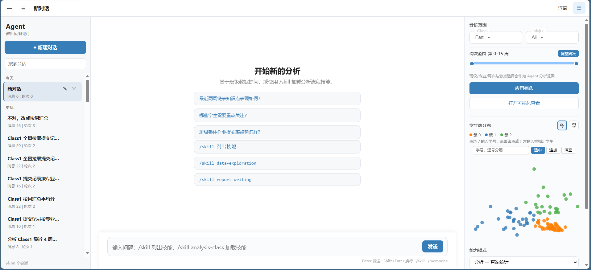
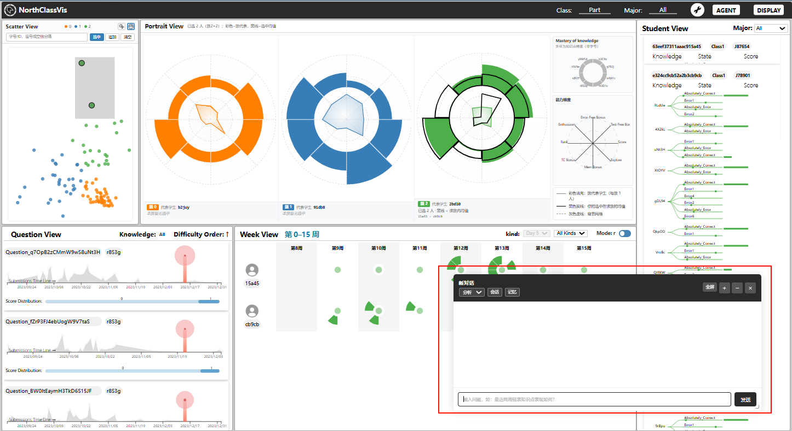
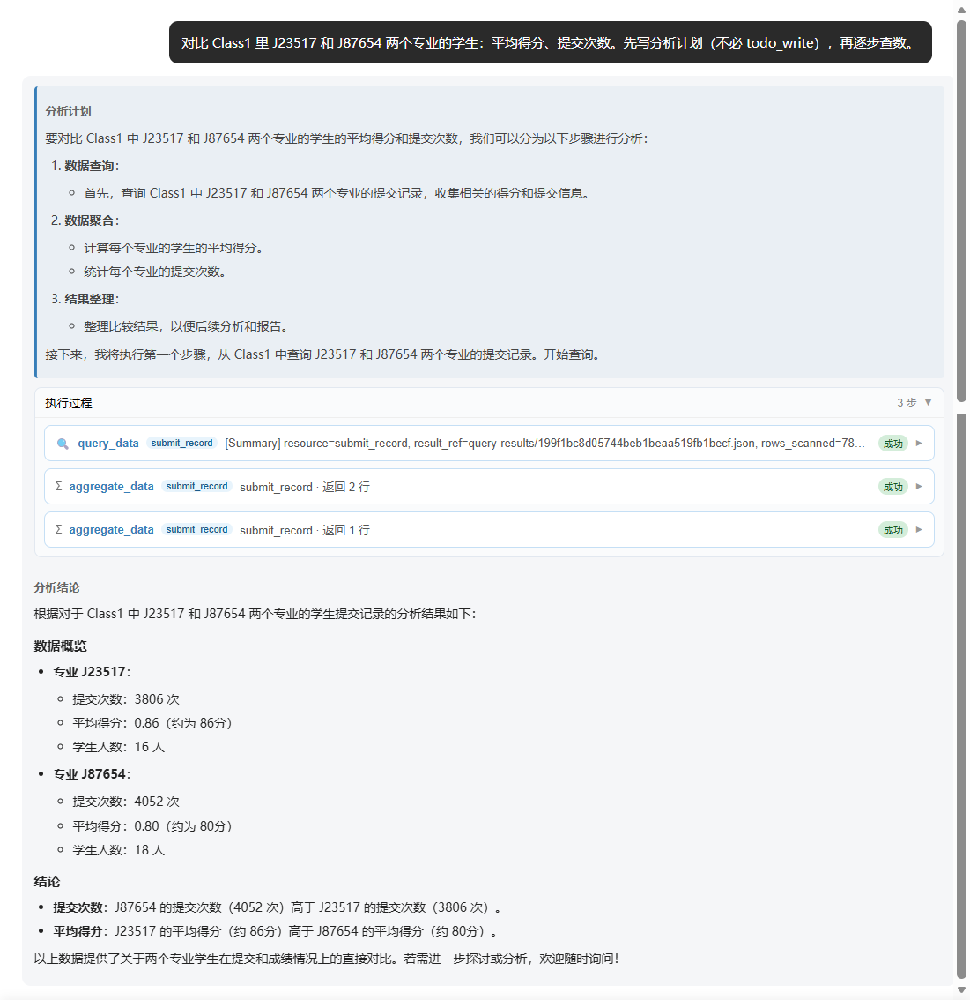
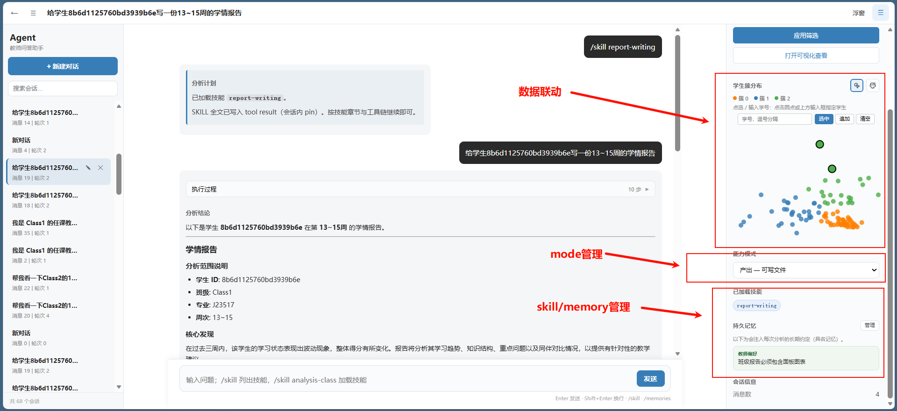
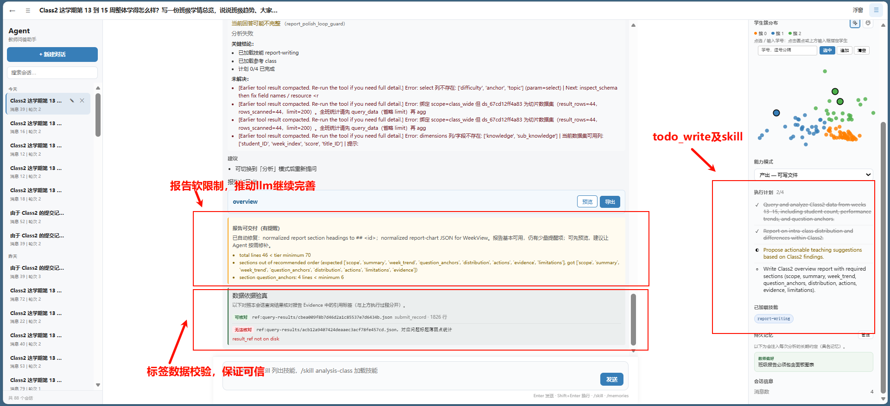
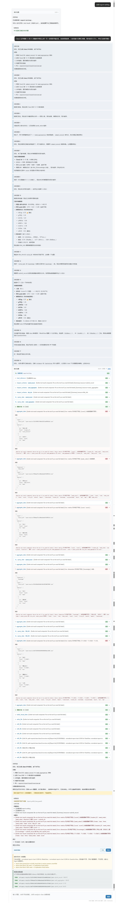

# NorthClassAgent

面向教育场景的数据分析 Agent 平台 · ChinaVis 2024 学情可视化底座

> **分支说明**：`main` 为当前 Agent 集成主线（本 README 所描述版本）；纯可视化历史版本见 `chainvis-original`。

---

## 项目简介

NorthClassVis 在 ChinaVis 2024 数据可视化竞赛作品基础上，扩展为**面向教师用户的智能学情分析平台**。教师可通过自然语言与 Agent 交互，自动完成学情查询、多维度聚合、智能报告生成，并联动五视图可视化面板动态展示结果，实现教育数据分析全流程智能化落地。

平台自研完整 **AgentLoop** 调度架构，与 Flask 可视化后端同进程部署，支持多轮工具调用、精细化权限管控、上下文智能压缩，以及 CLI / HTTP 双入口。

---

## 核心能力

### 项目整体架构

- 自研面向教育场景的数据分析 Agent 平台，搭建完整 AgentLoop 调度架构
- 支持多轮工具调用、精细化权限管控（consult / analyze / produce 等能力模式）与上下文智能压缩
- 面向教师提供自然语言交互入口（Dashboard 浮窗 + 独立 Agent 工作台）
- 可自动触发学情数据分析、多维度数据聚合、智能报告生成，并联动可视化面板展示结果

### 全套工具调用体系

- 基于 **Function Calling**，通过 Manifest 标准化注册 **17 类**智能工具
- 按**文件读写、会话管理、可视化适配、数据分析**四大维度重构处理器与模型调用规约
- 配套权限裁剪、数据路径管控、参数签名修复及 Hook 节点拦截机制
- 工具调用成功率 **94%**（在线评测）

### Agent 循环调度优化

针对传统 Agent 多轮调用冗余 IO、上下文膨胀、重复调用等痛点，在 Loop 核心层新增：

- 工具调用去重（`dedupe_tool_calls`）
- 低价值循环熔断（inspect_schema / load_skill / consult-list / todo-only 等 guard）
- 会话技能常驻锁定（skill pin）
- 数据链震荡多级处置（`data_chain_guard`）：对 query↔aggregate 空转、预览反复重查、纯探查空转等，先 soft 重定向（提示换法并清指纹），再 hard 熔断，避免同错误路径无限空转

优化后典型任务交互轮次**中位数由 5 轮降至 3 轮**，整体端到端耗时缩减至优化前的 **79%**。

### 跨会话记忆隔离治理

- 区分临时会话交付物与长期记忆存储逻辑
- 通过 Prompt 约束、内容合规校验、黑名单清单及权限拦截，避免学号、报告结论等临时业务数据污染长期记忆
- 保障 Agent 记忆精准度与多轮对话体验

### 数据链式绑定与缓存优化

搭建「**规则打分 + LLM 意图解析 + 硬规则校验**」三重数据意图绑定模块：

- 精准匹配用户查询口径，缩减上下文开销
- 针对统计口径变更场景，支持缓存重聚合与条件增量查询
- 在线 Binding 准确率 **93.75%**（详见 `docs/eval/binding-accuracy-online.md`）
- 会话数据集血缘：`query_data` / `aggregate_data` 结果登记为带 `dataset_id`、`grain`（row / agg）、`parent_dataset_id` 的目录；跨轮续算须显式 `list_datasets` 或传入 `dataset_id`（禁止静默复用上一轮 `result_ref`），系统侧持久化目录供绑定与溯源

### Prompt Cache（前缀缓存）优化

针对同会话多轮 tool call 反复改写 system、回写历史导致 DeepSeek prefix cache 失效的问题：

- 冻结同 mode 下 system 前缀；todo / datasets / deliverables / modify / 本轮 reminder 迁入本轮 user hint 或 tool result 快照，禁止回写更早消息
- `micro_compact` 跳过上一轮已送入 LLM 的消息前缀，避免改写已缓存中段

在 `deepseek-v4-flash` 标价下，input cache miss 为 $0.14 / 1M tokens，cache hit 为 $0.0028 / 1M tokens（约为 miss 单价的 1/50）。代表性 scope 场景对照（优化前基线 vs 优化后，同任务口径）：

| 指标 | 基线 | 优化后 | 变化 |
| ------ | ------ | ------ | ------ |
| 全价 miss tokens（input−cached） | 454,304 | 48,416 | 约少 89.3% |
| 等效计费 tokens（miss + cache×0.02） | 462,353 | 57,939 | 约少 87.5% |
| raw input | 856,736 | 524,576 | 少 38.8% |
| cache hit rate | 47.0% | 90.8% | +43.8 pp |

上述「等效计费 tokens」按 hit/miss 单价比 0.0028/0.14≈0.02 折算，近似反映账单侧投入。全量 Agent Benchmark（37 场景 × 3 runs）中，正确性相对优化前不降反升（pass@1 约 51%→59%，binding 约 61%→67%），单 turn / 整场景中位延迟基本持平，未见因 cache 改造导致能力回退。详见 `docs/eval/prompt-cache-ship-gate-2026-07-20.md`（落地提交：`c001b76`）。

### 智能报告工作流

- 分章节续写、文件迭代编辑（`edit_file`）、内容合规校验
- 自定义可视化图表嵌入协议（`visual_link_contract.yaml`），报告支持「长文 + 交互式图表」
- 平均报告篇幅由约 50 行优化至约 **150 行**

### 可信交付与故障自愈

- 数据溯源引用标签，报告结论、数据来源、运行快照可追溯
- 分类适配输出截断、上下文溢出、限流报错等故障场景
- 分级重试、内容压缩、退避终止的智能决策树，提升长对话与大批量报告生成稳定性
- 可选接入 **Langfuse** 做 LLM / 工具链路追踪

---

## 技术栈

| 层级   | 技术                                                           |
| ------ | -------------------------------------------------------------- |
| 后端   | Python 3.11、Flask、gunicorn、pandas、numpy、scikit-learn      |
| Agent  | AgentLoop、Function Calling、OpenAI API、SSE、Langfuse（可选） |
| 前端   | Vue 3、Vuex、Vue Router、Vite、axios                           |
| 可视化 | D3.js、ECharts                                                 |
| 部署   | Docker + Nginx 单镜像（`deploy/Dockerfile`）                   |

---

## 架构概览

```
浏览器 (Vue3 + D3)
    │  /api/*
    ▼
Flask (app.py)
    ├── routes/*          # 五视图 viz API
    ├── routes/agent_*    # Agent HTTP（会话 / Job / SSE）
    └── agent/
        ├── loop.py       # AgentLoop 调度
        ├── tools/        # Manifest + handlers + runtime
        ├── permission/   # 能力模式与审批
        ├── session/      # 多会话持久化
        ├── skills/       # 技能注册与加载
        └── eval/         # Binding 在线评测

共享数据层：core/ · domain/ · services/ · data/
```

教师提问 → AgentLoop → 工具链（query / aggregate / write）→ 报告产出 + visual link → 前端五视图联动。

---

## 项目结构

```
NorthClassVision/
├── backend/
│   ├── app.py                  # Flask 入口（viz + Agent 同进程）
│   ├── config/ core/ domain/ services/   # 共享数据与特征层
│   ├── routes/                 # viz API + agent_routes
│   └── agent/                  # Agent 核心
│       ├── loop.py             # AgentLoop
│       ├── http/               # HTTP 服务与 Job
│       ├── tools/              # definitions / handlers / runtime
│       ├── permission/ session/ skills/ memory/
│       └── eval/               # binding 准确率评测
├── frontend/
│   ├── src/views/              # Dashboard、AgentView
│   ├── src/components/agent/   # 对话 UI、报告嵌入、图表联动
│   └── src/components/         # Scatter / Week / Student 等五视图
├── data/
│   ├── Data_SubmitRecord/      # 班级提交 CSV
│   └── meta/                   # 契约：ontology、visual_link、registry
├── skills/                     # data-exploration、report-writing 等
├── docs/plans/                 # Agent 路线图与设计文档
├── docs/eval/                  # Binding 评测说明
├── deploy/                     # Docker 部署
└── notes/                      # D3 / ML / Agent 学习笔记
```

---

## 快速开始

### 环境要求

- Python **3.11+**
- Node.js **18+**（推荐 20）
- 数据集：参见 `problem.md` 下载后放入 `data/`

### 1. 克隆与依赖

```bash
git clone -b chinavis-agentloop git@github.com:holyguacamoleCoder/NorthClassVis.git
cd NorthClassVis

pip install -r requirements.txt
cd frontend && npm install && cd ..
```

### 2. 配置 Agent（可选，未配置时使用规则兜底）

```bash
cp backend/.env.example backend/.env
# 编辑 backend/.env，填入 OPENAI_API_KEY、OPENAI_MODEL 等
```

### 3. 启动服务

```bash
# 终端 1：后端
cd backend
flask run
# 或：python -m flask run --host 0.0.0.0 --port 5000

# 终端 2：前端
cd frontend
npm run dev
```

浏览器访问：

- **Dashboard（可视化 + Agent 浮窗）**：<http://localhost:8080/>
- **Agent 工作台**：<http://localhost:8080/agent>

### 4. CLI 模式（可选）

```bash
cd backend/agent
python agent_service.py
```

### 5. Docker 部署

```bash
docker build -f deploy/Dockerfile -t northclassvis:latest .
docker run -p 8080:80 -v $(pwd)/backend/.env:/app/backend/.env northclassvis:latest
```

### 6. 运行评测（可选）

```bash
cd backend
pytest agent/test/ test/ -q
python -m agent.eval.run_binding_online_eval   # 需配置 LLM
```

---

## 文档索引

| 文档                                     | 说明                    |
| ---------------------------------------- | ----------------------- |
| `docs/plans/agentic-analysis-roadmap.md` | Agent 分阶段路线图      |
| `docs/eval/binding-accuracy-online.md`   | 在线 Binding 准确率评测 |
| `docs/eval/binding-accuracy.md`          | Binding 离线评测        |
| `docs/eval/agent-benchmark.md`           | 通用 Agent Benchmark    |
| `docs/eval/prompt-cache-ship-gate-2026-07-20.md` | Prompt Cache 上线闸门与成本对照 |
| `data/meta/visual_link_contract.yaml`    | 五视图联动契约          |
| `data/meta/analysis_ontology.yaml`       | 分析粒度与 Lens 矩阵    |
| `skills/README.md`                       | 技能目录说明            |

---

## 可视化底座（起源）

本项目源于 **ChinaVis 2024** 数据可视化竞赛作品的学习复现（非 1:1 还原），核心可视化能力包括：

- 基于 **D3.js** 的平行线图、环形柱状图、雷达图、树形图等多类型图表
- 自实现 **PCA** 降维与 **KMeans** 聚类，对比 sklearn 实现
- **Vue 3 + Vuex** 复杂状态管理，批处理式视图更新
- 单例 / 工厂 / 观察者等设计模式组织配置与特征计算

纯可视化版本请切换分支：`git checkout chainvis-original`

---

## Agent 面板预览

教师可通过**全屏工作台**或**Dashboard 浮窗**使用 Agent。

| 入口 | 适用场景                             | 进入方法                                  |
| ---- | ------------------------------------ | ----------------------------------------- |
| 浮窗 | 看图时顺手提问，不离开五视图         | 在agent工作提台中点击右上角浮窗可换入     |
| 全屏 | 多会话、写报告、框选范围、看完整过程 | 通过agent路由或dashboard面板agent按钮进入 |

### 1. 双入口

a. 工作台网址：<http://localhost:8080/agent>



b. 进入浮窗：点击右上角“浮窗”按钮进入dashboard，agent变为浮窗



### 2. 三段式分析与工具透明

计划--过程--结论

ReAct典型回复范式



### 3. 报告生成





---

### 4. 报告样例：Class2 班级总览

完整交付物见 [`src/README/class2-overview.md`](src/README/class2-overview.md)  
（由 Agent 在 **produce** 模式下自动生成）

**教师输入（示意）**

> 为 Class2 写第 13–15 周班级学情总览，包含趋势、薄弱知识点和教学建议。

**Agent 逻辑（三层）**

1. **模板层** — 加载 `class` 报告规范，确定 8 个标准章节
2. **数据层** — `inspect_schema` → `query_data` → `aggregate_data`，从 CSV 实时聚合
3. **交付层** — 分章 `edit_file` 写入；Evidence 用 `[@ref:…]` 溯源；`report-chart` 与五视图联动

**样例中的关键结论**

| 发现                        | 数据依据（报告内章节）               |
| --------------------------- | ------------------------------------ |
| 全班均分 1.46/3.0           | `summary` + Evidence ref             |
| 周 peak 三连降（0.78→0.49） | `week_trend` + WeekView 图           |
| 最薄弱 `r8S3g`（0.75）      | `question_anchors` + QuestionView 图 |
| 班内两极分化（3.0 vs 0.74） | `distribution` + ScatterView 图      |

**分章写入（为何不是一次性生成）**

| 步骤 | 工具         | 对应章节                                    |
| ---- | ------------ | ------------------------------------------- |
| 1    | `write_file` | 标题 + 全部 `##` 骨架 + `scope` / `summary` |
| 2…n  | `edit_file`  | 逐章填充 `week_trend` … `actions`           |
| 末   | `edit_file`  | `evidence`、`limitations`（cite 标签）      |

`edit_file` 用 `## 章节名` 整节替换，避免把整篇报告反复塞进模型上下文。

**与静态知识库的区别**

- `overview.md` 里的**数字、趋势、排名** → 运行时 `aggregate_data`
- 题目/知识点**语义说明**（考什么、概念是什么）→ 规划中的 RAG 静态库，**不**写进班级总览的数字结论



---

## 可视化面板预览（旧版）

1. 选择班级与专业，提交配置


1. 后端配置完成，五视图渲染


1. 框选学生，Portrait / Week / Student 联动


更多截图见下文原版预览区。


---

## 许可证与说明

竞赛数据使用请遵循 `problem.md` 与官网要求。学习记录见 `notes/` 目录。
