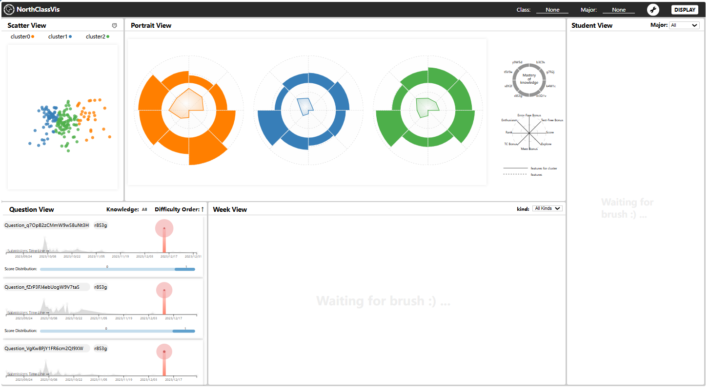

# NorthClassVis

ChinaVis 2024数据可视化竞赛作品复现

## 项目简介

本项目是2024年数据可视化竞赛的参赛作品非1:1复现(仅有大致原作成品参考，无原型图、设计稿等)，旨在基于可视化作品学习**D3.js**、**flask**的相关知识。

项目包含：

- 使用`Vue2`框架构建交互式用户界面，结合`Vuex`实现复杂状态管理和界面交互（未来可能重写为`Vue3`）。

- 基于`D3.js`开发多类型图表（平行线图、环形柱状图、雷达图、树形图等），支持动态数据绑定和实时更新。

- 使用`axios`接受和发起请求，构建可复用的api文件

- 使用`Flask`框架搭建高性能 API 服务，提供数据查询和分析接口。

- 使用`pandas`/`numpy`对`.csv`文件处理，计算数据特征。

- 利用自主实现`PCA`降维和`kmeans`聚类

- 利用`sklearn`库学习对比降维和聚类算法

- 应用面向对象设计模式，通过`单例模式`、`工厂模式`以及`观察者模式`优化全局配置和计算件管理，提高代码复用性和可维护性。

- 整体采用`批处理软件结构风格`，优化前端性能和用户体验。

- 通过`依赖注入`实现类，实现代码解耦和可维护性。

- ~~实现视口动态渲染和并行渲染技术，显著提升页面加载速度和用户体验。~~

- ~~利用静态 JSON 数据测试前端样式，确保界面一致性和兼容性。~~

- ~~使用`pytest`编写单元测试，覆盖关键业务逻辑，确保后端功能的稳定性和可靠性。~~

- ~~手写节流和防抖函数，优化用户体验。~~

笔者目前也在学习, 学习记录、学习资源见**notes**文件夹

## 项目结构

项目包含以下核心文件和目录：

```
NorthClassVision/
├── data/ # 数据集文件夹
│   ├── Data_SubmitRecord/
│   ├── Data_StudentInfo.csv
│   ├── Data_TitleInfo.csv
│   └── first_dataDes.docx
├── backend/  # 后端代码
│   ├── test/ # 测试文件
│   ├── routes/ # 路由实现和配置
│   ├── tools/ # 工具函数实现
│   └── app.py
├── frontend/ # 前端代码
│   ├── public/
│   ├── src/
│   │   ├── assets/
│   │   ├── components/
│   │   |   ├── CheckboxDropdown.vue # 下拉菜单
│   │   |   ├── ConfigPanel.vue # 配置面板
│   │   |   ├── IconBlock.vue # 右上角图标块
│   │   |   ├── LoadingSpinner.vue # 加载图标
│   │   |   ├── NavHeader.vue # 导航栏
│   │   |   ├── ParallelView.vue
│   │   |   ├── PortraitView.vue
│   │   |   ├── QuestionView.vue
│   │   |   ├── ScatterView.vue
│   │   |   ├── StudentView.vue
│   │   |   └── WeekView.vue
│   │   ├── router/
│   │   ├── store/
│   │   ├── views/
│   │   └── App.vue
│   ├── .gitignore
│   ├── babel.config.js
│   ├── package.json
│   ├── README.md
│   └── vue.config.js
├── notes/ # 学习思考笔记
│   ├── D3_study.md # D3.js绘制相关图的心得
│   ├── DesignPatterns.md # 为什么笔者要用设计模式
│   ├── hands_on_KMeans.ipynb # 笔者学习和复现K-Means的笔记
│   ├── hands_on_PCA.ipynb # 笔者学习和复现PCA的笔记
│   ├── MachineLearning.md # 对比了聚类和降维算法效果
│   ├── optimization_journey.md # 优化学习，暂时未完成
│   └── study_recourse.md # 一些第三方网络学习资料
├── problem.md # 竞赛内容，含官方数据集下载链接
└── README.md
```

## 如何运行

> 注意：版本兼容 python: 3.11.1, node: v16.20.2, npm: v8.19.4

0. 参见**problem.md**前往官网下载数据集，放置在data文件夹下

1. 克隆项目到本地：

```bash
git clone https://github.com/holyguacamoleCoder/NorthClassVision.git
```

2. 进入项目目录：

```bash
cd NorthClassVision
```

3. 安装后端依赖：

```bash
pip install -r requirements.txt
```

4. 启动后端服务：

```bash
cd backend
flask run
```

5. 安装前端依赖

```bash
cd ../frontend
npm install
```

6. 启动前端服务：

```bash
npm run serve
```

7. 打开浏览器，访问 `http://localhost:8080` 查看可视化效果。

## 样式预览

1. 选择配置班级和专业


2.点击submit按钮，等待后端配置成功


3.此时后端配置完成，前端部分组件也已经更新渲染



4.点击刷选工具，框选数据，点击DISPLAY按钮。随后可以在PortraitView看到被选中学生的指标平均值（黑色），Week/Student View后端正在计算


5.再试着框选一些并点击DISPLAY，点击StudentView具体框可以展开


6.WeekView展示的是被选中学生的每周不同知识点进展


7. 其他一些样例，请欣赏


 