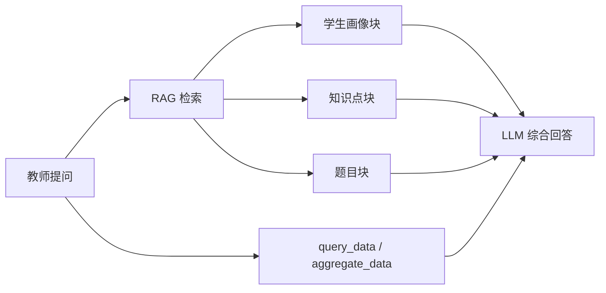

# RAG 分块策略（规划稿）

> **状态**：未实现，供后续引入向量检索时参考。  
> **定位**：NorthClassVision 当前以 `query_data` / `aggregate_data` 结构化查询为主，**尚无向量库与 embedding 管线**。本文档描述两条最可能落地 RAG 的业务线及其分块策略。  
> **关联契约**：`data/meta/analysis_ontology.yaml`、`data/meta/resource_registry.yaml`、`data/meta/data_catalog.md`

---

## 1. 总体原则

| 原则 | 说明 |
|------|------|
| 结构化事实走工具 | 原始 CSV、万级 `SubmitRecord` 行继续经 `query_data` / `aggregate_data`，不入向量库 |
| 语义实体整块入库 | 学生画像、单道短题、子知识点等不可分割单元**不分块** |
| 长非结构化文本才切 | 专业培养方案、长阅读题干等使用递归字符分块 |
| 元数据过滤 + 向量召回 | `student_ID`、`class`、`major`、`knowledge` 等作为检索过滤条件，不参与 embedding |
| 与现有证据链兼容 | 细查仍用 `[@ref:query-results/...]`；RAG 负责粗筛与语义匹配 |

**核心口诀**：语义上不可分割的实体（学生、单题、子知识点）整块入库；只有真正的长非结构化文本才做递归分块。

---

## 2. 场景一：离线学生画像

### 2.1 业务动机

教师常以自然语言提问，例如：

- 「T1 这名学生整体什么情况？」
- 「有没有和 T1 一样，链表周峰高但正确率低的？」
- 「J78901 专业里哪些学生需要重点关注？」

这类问题不适合每次实时扫描万行 `SubmitRecord`，更适合 **离线聚合 → 写入向量库 → 检索召回**。

### 2.2 分块策略：不分块，一人一块

**做法：**

1. 离线任务遍历全体 `student_ID`，复用现有 `query_data` / `aggregate_data` 及 `week_aggregation` 资源计算指标。
2. 为每个学生生成一段**自然语言画像**，作为独立 Document 存入向量库。
3. **不做任何切分**；`student_ID` 即文档 ID。

**单块内容模板（示例）：**

```text
学生 e89cdaa3（男，19岁，专业 J57489，Class2）
周趋势（13–15周）：周峰得分 1.2 → 1.8，参与人数逐周下降
薄弱知识点：g7R2j（468次尝试，正确率 32%）、b3C9s（勾连题组）
强项：r8S3g 子知识点掌握稳定
行为特征：平均耗时偏高，memory 指标波动大
同龄对比：班级内正确率排名约 40%，周峰趋势高于专业均值
```

**元数据（过滤用，不参与 embedding）：**

| 字段 | 说明 |
|------|------|
| `student_ID` | 学生唯一标识 |
| `class` | 班级（如 Class2） |
| `major` | 专业代码（如 J57489） |
| `sex`, `age` | 人口学属性 |
| `week_range` | 画像覆盖周次 |
| `weak_knowledge[]` | 薄弱知识点列表 |
| `strong_knowledge[]` | 强项知识点列表 |
| `profile_version`, `updated_at` | 版本与更新时间 |

### 2.3 为何不分块

与「技师信息不可分割」同理——学情画像是完整诊断单元：

| 风险 | 举例 |
|------|------|
| 张冠李戴 | 检索到「正确率 32%」，却丢失学生 ID 或知识点 |
| 上下文断裂 | 「周峰上升」与「参与下降」被切到不同块，无法判断进步还是倦怠 |
| 长度适中 | 离线画像通常 200–400 tokens，已在 embedding 窗口内 |

### 2.4 检索流程

```text
教师提问
  → 向量检索 Top-K 学生画像
  → 元数据过滤（如 class=Class2, major=J78901）
  → LLM 基于召回画像回答 / 输出重点关注名单
  → 必要时再调 query_data 做实时细查
```

### 2.5 更新策略

| 触发条件 | 动作 |
|----------|------|
| 每日 / 每周定时 | 全量或增量重算画像 |
| 新一周提交数据入库 | 按 `week_index` 增量更新受影响学生 |
| 教师点名某学生 | 可触发该生画像即时刷新（可选） |

---

## 3. 场景二：题目内容 + 专业 / 子知识点

### 3.1 业务动机

当前 `Data_TitleInfo.csv` 仅有 `title_ID`、`score`、`knowledge`、`sub_knowledge`，**尚无题干正文**。后续若补充：

- 题目题干、选项、参考答案、解析
- 知识点说明（如 `r8S3g` →「链表基础」）
- 专业培养方案（如 `J87654` 课程大纲、能力要求）

则可支持：

- 「学生在链表相关题目上错在哪类思路？」
- 「这道题和班级薄弱点是否一致？」
- 「J78901 专业学生做勾连题组时常见误区是什么？」

此时 RAG 检索的是**题目语义 + 知识层级 + 专业语境**，而不只是 ID。

### 3.2 分块策略：按内容类型分三类

#### 第一类：单道题目 —— 不分块（默认）

**适用：** 编程题、选择题、填空题等，单题正文 < 500 tokens。

**做法：** 每道题一个 Document，题干 + 选项 + 解析 + 关联学情统计拼成一块。

**示例：**

```text
题目 Question_VgKw8PjY1FR6cm2QI9XW（分值 1）
知识点：r8S3g / r8S3g_l0p5viby（链表·指针操作）
题干：给定单向链表 head，删除第 n 个节点……
解析：双指针法，先走 n 步再同步移动……
学情：Class2 正确率 28%，常见错误 state=Wrong_Answer（占 45%）
```

**元数据：** `title_ID`, `knowledge`, `sub_knowledge`, `score`, `class_correct_rate`（可按班扩展）

**原因：** 一道题是完整考查单元；切开题干与解析会导致检索只命中「双指针法」，却不知道考的是哪道题、哪个知识点。

---

#### 第二类：知识点 / 子知识点说明 —— 按层级分块，块内不分块

**适用：** 知识点百科、教学大纲片段、子知识点讲解。

**做法：**

- 每个 `sub_knowledge` 一块（如 `r8S3g_l0p5viby`）
- 每个 `knowledge` 父节点一块（汇总子知识点 + 教学重点）
- 块内包含：名称、定义、前置知识、关联题目 ID 列表、班级薄弱统计

**示例：**

```text
子知识点 r8S3g_l0p5viby：链表节点删除
定义：在 O(n) 时间内删除单链表第 n 个节点……
前置：r8S3g 指针遍历
关联题目：Question_VgKw8PjY1FR6cm2QI9XW 等 3 道
班级薄弱：Class2 正确率 32%，Class5 正确率 51%
```

**元数据：** `knowledge`, `sub_knowledge`, `parent_knowledge`, `related_title_ids[]`

**原因：** 教师问「链表薄弱点」时应召回整个子知识模块，而非某个切分片段。

---

#### 第三类：专业培养方案 / 长阅读题干 —— 递归字符分块

**适用：**

- 专业文档（如 J78901 课程体系、能力矩阵）——数千字
- 长题干（阅读理解、综合案例题）——超过 500 tokens

**做法：**

- 使用 `RecursiveCharacterTextSplitter`（或等价实现）
- `chunk_size`：400–500 tokens
- `chunk_overlap`：50 tokens
- 切分优先级：段落（`\n\n`）→ 句子（`。` / `\n`）

**元数据（每块必带）：** `major` 或 `title_ID`、`knowledge`、`chunk_index`、`total_chunks`

**原因：**

- 专业文档无固定 `##` 结构，需按自然语义切分
- overlap 避免关键约束（如「能力要求：掌握链表」）被拦腰截断
- 长题干切分后每块仍带 `title_ID`，检索时可拼回完整题目上下文

### 3.3 三类策略对照

| 内容类型 | 策略 | 粒度 | 典型 token |
|---------|------|------|-----------|
| 单道题目（短） | 不分块 | 1 题 = 1 Document | 100–400 |
| 知识点 / 子知识点 | 不分块 | 1 节点 = 1 Document | 200–600 |
| 专业方案 / 长题干 | 递归字符分块 | 多段，带 overlap | 400–500 / 块 |

### 3.4 检索流程（与学情数据联动）

```text
教师：「Class2 链表题错在哪？」
  │
  ├─ aggregate_data → Class2 在 knowledge=r8S3g 的正确率、高频错题
  │
  ├─ RAG 召回 sub_knowledge 说明块 + 相关题目块
  │
  └─ LLM 综合数据事实 + 题目语义 → 「错在指针边界判断，建议……」
```

---

## 4. 两场景协同

| 维度 | 场景一：学生画像 | 场景二：题目 / 知识点 |
|------|----------------|---------------------|
| 索引时机 | 离线批量（每日 / 每周） | 题目入库时 + 学情统计定期更新 |
| 分块 | **不分块**，一人一块 | 短题 / 知识点不分块；长文递归切 |
| 检索目的 | 找人、找相似学生 | 找题、找知识、找教学依据 |
| 与工具链 | 画像粗筛 → 工具细查 | 工具出统计 → RAG 补语义 |

**组合示例：**

> 「Class2 里谁最需要补链表，该练哪几道题？」

1. 元数据过滤 `class=Class2` + 向量检索 `weak_knowledge` 含 `r8S3g` 的学生画像（场景一）
2. 检索 `sub_knowledge=r8S3g_*` 的题目块 + 知识点说明（场景二）
3. `query_data` 拉取这些学生对具体题目的 `state` 分布（现有工具）
4. LLM 输出：重点关注名单 + 推荐练习题 + 教学建议



---

## 5. 明确不纳入 RAG 的内容

与现有 `memory_policy.py` 隔离策略一致：

| 内容 | 原因 |
|------|------|
| 原始 CSV 全量 | 体量大；Agent 已禁止 `read_file` 直读 |
| `backend/.agent/sessions/` 运行时状态 | 会话私有，非知识资产 |
| 带学号 + 周次的细粒度会话交付物 | 隐私与跨会话隔离 |
| TabularResult 原始万行 JSON | 应生成摘要块 + `result_ref`，不做行级 embedding |

---

## 6. 实现备忘（后续 Phase）

| 步骤 | 说明 |
|------|------|
| 画像 ETL | 新增离线脚本：遍历 `student_ID` → 调聚合逻辑 → 写画像 JSON / 直接向量化 |
| 题目内容接入 | 扩展 `Data_TitleInfo` 或旁路 `data/questions/` 存题干与解析 |
| 向量库选型 | Chroma / FAISS / pgvector 等，按部署环境决定 |
| Agent 工具扩展 | 可选新增 `search_profiles` / `search_questions` tool，或在意图路由层透明调用 |
| 与报告流水线 | 历史 `reports/*.md` 可按 `##` 章节分块作为第三条线（本文档暂不展开） |

---

## 7. 参考路径

```
data/Data_StudentInfo.csv
data/Data_TitleInfo.csv
data/Data_SubmitRecord/SubmitRecord-{Class}.csv
data/meta/resource_registry.yaml
data/meta/analysis_ontology.yaml
backend/agent/data/derived.py          # week_aggregation 等派生逻辑
backend/agent/report/sections.py       # 报告章节切分（未来报告 RAG 可复用）
backend/agent/common/memory_policy.py  # 记忆隔离策略
docs/plans/agentic-analysis-roadmap.md
```
