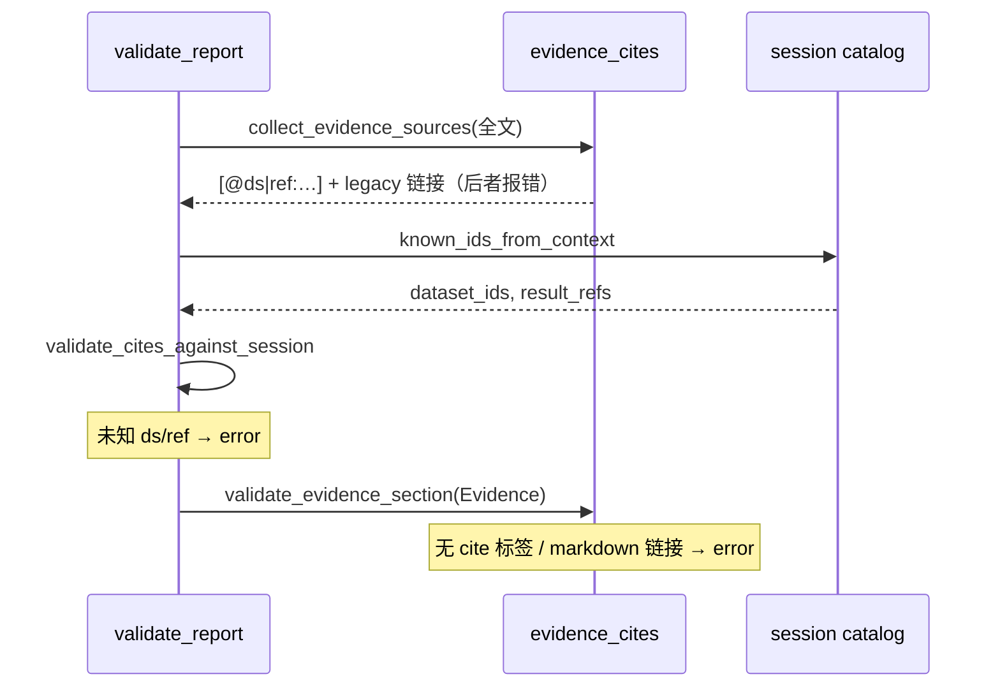
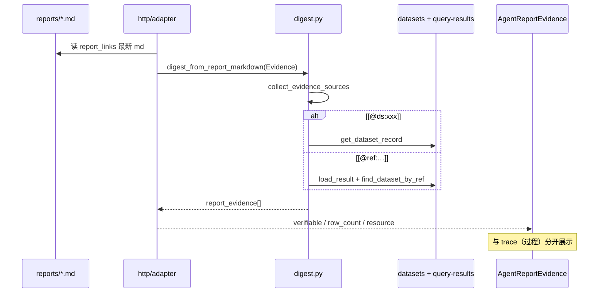

# 报告可信交付与 Skills 瘦身 — 实施计划

> 分支：`feat/report-trust-delivery`  
> 来源：Skills 编写评审 + 长文/可交互图/证据可追溯设计讨论（2026-07）  
> 状态：Phase 0–6 已完成（分支待合并）

## 背景与目标

### 现状问题

1. **Skills 臃肿**：`report-writing/SKILL.md` 与 4 个 `references/*.md` 大量重复（图表约束、Evidence/Limitations、写作禁令）；`load_reference` pin 全文时 token 浪费严重。
2. **报告偏短**：平均约 50 行，缺少「厚报告 + 嵌入式交互图」的交付标准（目标约 120–180 行）。
3. **无写后校验**：章节缺失、篇幅不足、`report-chart` 与 `build_visual_links` 不一致时无自动反馈。
4. **证据不可验真**：HTTP `evidence` 实为 `trace.steps` 的工具摘要，与正文 `## Evidence` 未绑定；过程轨迹与交付物验真混用。
5. **断链**：`SKILL.md` 列出 `references/mixed.md` 但文件不存在。

### 总目标

| 维度   | 目标                                                                             |
| ------ | -------------------------------------------------------------------------------- |
| 交付物 | 长文 Markdown + `report-chart` 可交互图；分章 `write_file` / `edit_file` 续写    |
| 质量   | 写后自动校验（结构 / 篇幅 / 图表 / 引用），结果回流 tool result                  |
| 可信   | 正文 `[@ds:…]` / `[@ref:…]` 绑定会话数据；HTTP 区分 `report_evidence` 与 `trace` |
| Skills | 薄入口 + `_shared.md` + tier delta；契约与脚本为单一事实来源                     |

### 设计原则（create-skill）

- **MD**：何时写、怎么组织、定性 acceptance、示例与反模式（短表）。
- **YAML 契约**：章节 id、行数阈值、图表规则、引用标签语法。
- **Python 脚本/库**：解析、计数、对照 `result_ref`、postprocess 挂钩；CI 与 Agent 共用。

---

## 架构：三层分工

```text
data/meta/                    # 机器可读契约（可测、可调参）
  analysis_ontology.yaml      # 已有：粒度 × lens、个体章节
  visual_link_contract.yaml   # 已有：view params
  report_quality_rules.yaml   # 新建：tier 必填章、行数、表格
  report_chart_protocol.yaml  # 新建：fence 语法、per-view 限制
  evidence_cite_protocol.yaml # 新建：[@ds|ref:…] 语法

backend/agent/report/         # 校验运行时（write 后 / CLI / 测试）
  parse.py                    # ## <id> 结构解析
  charts.py                   # report-chart 提取 + validate_links
  evidence_cites.py           # 引用标签解析
  validate.py                 # 统一入口 validate_report(...)

skills/report-writing/        # Agent 写作指南（渐进披露）
  SKILL.md                    # 薄：workflow + 路由 + checklist
  references/_shared.md         # 通用图表/写作/cite 示例
  references/{student,class,major,freeform}.md  # 仅 tier delta

scripts/validate_report.py    # CLI：本地 / hooks / CI
```

**Prompt 分工**（保持不变）：

- `prompts.py`：模式边界、路由表（无 SKILL 全文）
- `load_skill` / `load_reference`：pin 全文
- `write_file` / `edit_file` postprocess：附加 `[Report validate: …]`

---

## 阶段划分

### Phase 0 — 计划与契约骨架 ✅ 本分支首批

- [x] 本文档
- [x] `report_quality_rules.yaml`
- [x] `report_chart_protocol.yaml`
- [x] `evidence_cite_protocol.yaml`
- [x] `backend/agent/report/*` + `scripts/validate_report.py`
- [x] `test/test_report_validate.py`（fixture 过/不过）
- [x] `skills/README.md` 指向本计划

**验收**：`py scripts/validate_report.py --tier student --file <fixture>` 输出结构化 JSON；pytest 绿。

### Phase 1 — 写后反馈闭环 ✅

- [x] `postprocess.py`：`write_file` / `edit_file` 成功后对 `reports/*.md` 调用 `validate_report`
- [x] 将 `errors` / `warnings` 追加到 tool result
- [x] tier 推断：路径启发式 `reports/student/` → `student` 等
- [x] `build_visual_links` 结果登记到 `AnalysisToolContext.session_visual_links`

### Phase 2 — Skills 瘦身 ✅

- [x] 新建 `references/_shared.md`
- [x] 瘦身 `report-writing/SKILL.md`
- [x] 瘦身 `student|class|major|freeform.md`
- [x] 删除 `mixed.md` 引用
- [x] `load_reference` tier 加载时 prepend `_shared.md`

### Phase 3 — 分章续写工作流 ✅

- [x] Skill workflow：首轮 `write_file` 骨架 → 分章 `edit_file`
- [x] `validate_report`：章节顺序、空章检测

### Phase 4 — report-chart 强校验 ✅

- [x] `validate_charts_against_session` 对比 `session_visual_links`
- [x] `check_chart_explanations` 图表下方解释行数

### Phase 5 — 证据引用与 HTTP 分层 ✅

- [x] `evidence_cites` 会话 `dataset_id` / `result_ref` 校验
- [x] `digest.py` → HTTP `report_evidence`
- [x] `adapter.py`：`process_evidence` + `report_evidence`；`evidence` 保留兼容

### Phase 6 — 校验可见性与 cite 强化 ✅

- [x] 计划文档补充写后校验 + 标签验真时序图（见下）
- [x] `require_evidence_cites: true`（`report_quality_rules.yaml` global）
- [x] Evidence 中 Markdown 链接 `[text](query-results/…)` → **error**，须改为 `[@ref:…]`
- [x] 未知 `[@ref:…]` 不在会话 catalog → **error**（与 `[@ds:…]` 同级）
- [x] `collect_evidence_sources`：cite 标签 + legacy 链接（digest 兼容）
- [x] 前端 `AgentReportEvidence` 展示 HTTP `report_evidence` 验真摘要
- [x] **交付前终检** `finalize_report_file`：轮次结束自动修复（去重章节/图表）+ 再校验；失败不自动打开预览
- [x] **章节别名**：`## 范围/摘要/班级趋势…` 映射到 ontology `scope/summary/week_trend…`（`section_id_aliases`）
- [x] **前端超时取消 job**：空闲 3min 无进度或绝对 15min 上限 → `cancelAgentJob`，避免后台空转

**未做（后续）**：正文数字与 `result_ref` JSON 重算一致性；validate 失败自动续轮。

### Phase 7 — 校验分级与结构弹性（已完成 ✅）

> 背景：class `overview.md` 已写全 `#### 1. Scope` … `#### 8. Limitations`，但解析器只认 `##`，仍报 14 个 missing。说明「别名中文」不够，需要**分级 gate + 标题深度 + 语义覆盖**。

#### 原则

| 原则                 | 说明                                                                                 |
| -------------------- | ------------------------------------------------------------------------------------ |
| **验交付，不验排版** | 教师关心有没有趋势/证据/建议，不关心必须是 `## week_trend` 还是 `#### 3. Week Trend` |
| **少而硬的 blocker** | 阻断项只留「图表坏 / 无法渲染 / 重复 WeekView」；结构用覆盖度                        |
| **cite 分阶段**      | 写作中 warn → 交付前 error（可配置）                                                 |
| **机器修 + 人读**    | postprocess/finalize 尽量 normalize；教师 UI 用红黄绿，不 dump 14 条 error           |

#### 建议三级 gate（写入 `report_quality_rules.yaml` → `validation_levels`）

```yaml
validation_levels:
  draft: # 写章中 edit_file：只拦毁坏性错误
    block_on:
      [chart_json_invalid, chart_syntax_forbidden, weekview_cap_exceeded]
  deliver: # 默认终检 / goal_check：可交付
    block_on: [chart_*, section_coverage_below_threshold, evidence_cite_missing]
    warn_on: [line_count, section_order, chart_explanation, cite_not_in_catalog]
  strict: # CI / 未来「正式发布」
    block_on: [all_current_errors]
```

**`section_coverage`（替代「8 个 ## 缺一不可」）**

- 每 tier 定义 `required_section_groups` 或保留 `required_sections` + `min_coverage_ratio`（如 class：8 章中至少识别 **6/8** 即通过结构项）。
- 识别来源（优先级）：`##` / `###` / `####` 标题 + `section_id_aliases` + 英文 ontology id（`Scope` → `scope`）。
- 终检可选 **`normalize_headings: true`**：把 `#### 3. Week Trend` 提升为 `## week_trend` 写回（与 chart normalize 同级）。

#### 当前误报 vs 建议级别（class 报告实测）

| 现象                   | 现在                    | 建议                                  |
| ---------------------- | ----------------------- | ------------------------------------- |
| `#### 1. Scope` 有内容 | **error** missing scope | **识别为 scope**（扩展 heading 深度） |
| `## 范围` 中文         | 已修复 alias            | 保持                                  |
| 缺 cite 标签           | **error**               | **deliver: error**；**draft: warn**   |
| ref 不在 catalog       | **error**               | **warn**（会话快照滞后时常见）        |
| 行数 < 70              | warn                    | warn                                  |
| 章节顺序乱             | warn                    | warn                                  |
| WeekView > 1           | error                   | error（保持）                         |
| chart JSON 坏了        | error                   | error（保持）                         |

#### 教师 UI（与 gate 对齐）

- **可交付**：`deliver` 通过 → 绿 / 可预览
- **待修补**：仅有 warn → 黄 + 清单
- **不可交付**：blocker → 红 + 最多 3 条人话摘要（非原始 14 条）

#### 待你拍板的三项

1. **结构**：「8 章全覆盖」 vs 「6/8 覆盖即可」？
2. **标题**：是否允许 Agent 用 `#### 编号英文`（终检自动提升为 `## id`）？
3. **cite**：`require_evidence_cites` 在 **draft 阶段 warn、deliver 阶段 error** 是否接受？

**Phase 7 实现顺序（已完成）**：① `####` 解析 + Scope→scope alias ② `validation_levels` + coverage ③ finalize 标题 normalize ④ UI 红黄绿。

**Phase 7b — 体验防卡顿（已完成 ✅）**

| 项               | 行为                                                                                                    |
| ---------------- | ------------------------------------------------------------------------------------------------------- |
| 写后不再改写磁盘 | postprocess 仅在内存预览 normalize + `draft` 校验；图表去重/注入推迟到终检 `finalize`                   |
| 分析计划冻结     | 首轮 `thinking` 固定为「分析计划」；后续每轮思路单独成块「分析进展 N」，不再覆盖                        |
| 轮次上限         | `AGENT_MAX_TURNS_PER_ROUND` 默认 **12**；超限强制停止并摘要                                             |
| 报告空转守卫     | 同一 blocker 连续 3 次 → `report_validate_loop_guard`；连续 warn-only 修补 → `report_polish_loop_guard` |

---

## 写后校验流程（Phase 1+6）

校验在 `write_file` / `edit_file` 成功后的 **postprocess** 中触发，不是独立工具。

```mermaid
sequenceDiagram
    participant Agent
    participant Write as write_file / edit_file
    participant PP as postprocess
    participant Norm as normalize + inject
    participant Disk as reports/*.md
    participant Val as validate_report()
    participant Loop as AgentLoop

    Agent->>Write: 写入报告
    Write->>Disk: 落盘
    Write-->>PP: [Write OK: path=...]

    PP->>Disk: 读回 md
    PP->>Norm: fix 错误 chart 语法
    PP->>Norm: inject 缺失 report-chart
    Norm->>Disk: 若有改动再写回

    PP->>Val: validate_report(text, tier, analysis_context)
    Note over Val: 结构 / 篇幅 / 图表 / cite 对照会话
    Val-->>PP: { ok, errors[], warnings[] }

    PP-->>Agent: tool result + [Report validate]
    Note over PP,Agent: 有 error 时前缀 Error: → 工具步标为失败

    PP->>Loop: append_report_write_checks
    Note over Loop: reminder：有 error 勿宣称报告已完成
```

### `validate_report()` 检查项

| 步骤 | 检查项                                       | 失败级别  |
| ---- | -------------------------------------------- | --------- |
| 1    | 必填 `##` 章节（tier）                       | **error** |
| 2    | 总行数、每章行数、表格行数                   | warning   |
| 3    | 章节顺序、空章                               | warning   |
| 4    | `report-chart` JSON / view 合法性            | **error** |
| 5    | chart 与 `build_visual_links` 一致           | warning   |
| 6    | chart 下方解释行数                           | warning   |
| 7    | 全文 `[@ds:…]` / `[@ref:…]` 在本会话 catalog | **error** |
| 8    | Evidence 含 cite 标签（非 Markdown 链接）    | **error** |
| 9    | Evidence 使用 `[text](query-results/…)`      | **error** |

有 **error** → `ok: false` → tool result 前缀 `Error: Report validation failed…` → `goal_check.is_satisfied = false`。

**教师/开发者查看方式**：

- 执行过程：展开 write/edit 步骤，看 `[Report validate]` 块
- CLI：`py scripts/validate_report.py --tier student --file path/to.md`
- 单元测试：`pytest test/test_report_validate.py`

---

## 标签数据验真（Phase 5+6）

验真分两层：**写后同步校验**（绑 Agent 行为）与 **HTTP 响应摘要**（给教师/UI）。

### 标签语法

```markdown
[@ds:ds_a1b2c3d4e5f6 班级周均 peak，week 13–15]
[@ref:query-results/abc123.json]
```

对照来源：`AnalysisToolContext.turn_snapshots` + 会话 `datasets.jsonl`。

### 层 1 — 写后 cite 校验（postprocess）



### 层 2 — HTTP `report_evidence`（轮次结束）



**HTTP 字段区分**：

| 字段                 | 含义                         |
| -------------------- | ---------------------------- |
| `trace` / `evidence` | 工具执行过程摘要             |
| `report_evidence`    | 报告 Evidence 引用是否可核对 |
| `report_links`       | 交付物路径                   |

**验真边界**：当前为 **身份验真**（标签是否指向本会话数据），不含正文数字与 JSON 重算对比。

### 层 3 — 交付前终检（轮次结束，HTTP 响应前）

```mermaid
sequenceDiagram
    participant Loop as AgentLoop 结束
    participant Adapter as http/adapter
    participant Fin as finalize_report_file
    participant Disk as reports/*.md
    participant UI as 前端

    Loop->>Adapter: adapt_legacy_query_response
    Adapter->>Fin: 本轮最新 report 路径
    Fin->>Disk: 读 md → 修复 fence/去重章节/去重图表 → 写回
    Fin->>Fin: validate_report
    Fin-->>Adapter: report_final_check { ok, errors, fixes }

    alt ok
        Adapter-->>UI: goal_check 可满足；可自动预览
    else 仍有 error
        Adapter-->>UI: goal_check 不满足；展示「报告交付检查未通过」
    end
```

与 **写后校验** 的区别：写后校验在每次 `write/edit` 后立即反馈；终检在 **教师看到结果前** 对磁盘上最新报告再跑一遍修复 + 校验，避免重复章节/重复图表漏网。

---

## 契约摘要

### report_quality_rules.yaml

- `tiers`: `student` | `class` | `major` | `freeform`
- 每 tier：`min_total_lines`、`required_sections[]`、`sections.<id>.min_lines`、`require_chart`、`min_table_rows`
- 全局：`required_tail_sections: [evidence, limitations]`

### report_chart_protocol.yaml

- `fence_languages: [report-chart]`（兼容 `chart` / `json`）
- `max_per_view.WeekView: 1`
- `forbid_report_chart: [StudentView]`
- `view_params` → 引用 `visual_link_contract.yaml`

### evidence_cite_protocol.yaml

- 模式：`[@ds:<dataset_id>]`、`[@ref:query-results/<file>.json]`
- 可选摘要：`[@ds:xxx 班级周均 peak，week 13–15]`
- 禁止：无标签的「见上文 query」

---

## 分章写入约定（Phase 3 起）

| 轮次 | 工具         | 内容                                                   |
| ---- | ------------ | ------------------------------------------------------ |
| 1    | `write_file` | 标题 + 全部 `## <id>` 占位 + `scope` / `summary` 首稿  |
| 2…n  | `edit_file`  | 按 ontology 顺序填充 `week_trend`、`question_anchors`… |
| 末   | `edit_file`  | `evidence`（含 cite 标签）、`limitations`              |

禁止：在未跑完 analyze 查询前写分析章；禁止 `read_file` 旧 `reports/`。

---

## MD vs 脚本（速查）

| 能力                  | MD            | 脚本/YAML               |
| --------------------- | ------------- | ----------------------- |
| 何时分章、写作原则    | ✅            |                         |
| 章节 id 枚举          | 链接 ontology | ✅ rules yaml           |
| 行数/表格阈值         | 目标描述      | ✅ rules yaml           |
| report-chart 语法示例 | ✅ 1–2 个     | ✅ protocol yaml        |
| params 字段表         | ❌            | ✅ visual_link_contract |
| cite 写法示例         | ✅            | ✅ cite protocol        |
| 解析/验真/HTTP        | ❌            | ✅ Python               |

---

## 测试

```bash
# 单元测试
cd backend/agent && py -3.11 -m pytest test/test_report_validate.py -q

# CLI
py scripts/validate_report.py --tier student --file path/to/report.md
py scripts/validate_report.py --tier student --file path/to/report.md --json

# 回归（skills / agent）
cd backend/agent && py -3.11 -m pytest test/test_skills.py test/test_system_prompt.py -q
```

---

## 风险与依赖

| 风险                             | 缓解                                                   |
| -------------------------------- | ------------------------------------------------------ |
| 校验过严导致 Agent 反复 edit     | `error` vs `warning` 分级；阈值放 YAML 可调            |
| tier 自动推断错误                | CLI 显式 `--tier`；postprocess 用路径启发式 + warning  |
| 与 `analysis_ontology.yaml` 漂移 | required_sections 以 ontology 为注释来源；后续 CI diff |
| HTTP 破坏性变更                  | Phase 5 保留 `evidence` 别名一期                       |

---

## 相关文档

- [skills-analysis-tiers.md](./skills-analysis-tiers.md)
- [agentic-analysis-roadmap.md](./agentic-analysis-roadmap.md)
- `data/meta/analysis_ontology.yaml`
- `data/meta/visual_link_contract.yaml`
- `skills/README.md`
