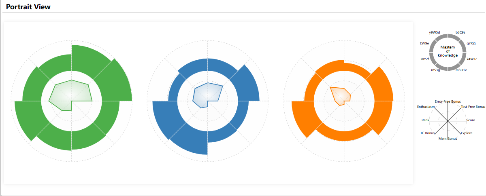

> 本篇md用于解释作品中所出现图的d3渲染思路

> chart/graph/plot/diagram 没有明显的意义区分

# General

使用d3作图的基本思路：

1. 创建dom元素（html）；处理数据
2. d3获取该元素，并提前声明好相关参数（如宽、高），使用js变量而非直接嵌入数值有利于代码维护和复用
3. 定义比例尺scale，将实际数据与实际渲染大小进行放缩，比例尺多种多样，比如线性、离散变量、区间变量，甚至颜色比例尺。
4. 对于特殊的形状（除过矩形rect等），可能需要定义特殊的曲线、弧线生成器，实际上，他们也是基于属性配置的，无需担心
5. 渲染坐标轴（根据需要）
6. 渲染图形，特殊图形可能需要path元素调用生成器
7. 使用text元素进行相关图例和标记
8. 对所有内容进行微调
9. 有些元素你希望渐变等特殊效果，可以使用css，甚至d3定义svg-defs

> 以上只是思路，细节代码可以从你的需求出发。
>
> 你可以以此为导向，在d3官方文档查到你想要的api，甚至可以直接询问LLM
>
> 特殊效果如css、svg可以查询MDN或询问LLM

# ParallelView/ScatterView

## parallel graph

**思路确定：**

从一般的图表理解，分为x轴和y轴，x轴代表时间，y轴代表数值；

所以在平行线图中，可以这样理解：x轴代表的是不同属性，y轴代表的是数值

在本视图中，共有8个属性---------因此需要渲染8个“y轴”，“x轴”需要定义（为了确定每个Y轴的放置位置）但是无需渲染

## scatter graph - PCA

 

# PortraitView

## relative axis and labels

## circular barplot

## radar/spider plot

# StudentView

## view pannel

## tree diragram

# QuestionView

## ~~view pannel~~

与StudentView的view pannel思路别无二致，不再赘述

## area chart

## horizontal stacked bar

## candy chart

# WeekView

## ~~circular barplot~~

同PortraitView中的，此处关键在于确定每个barplot的圆心位置

## week axis

