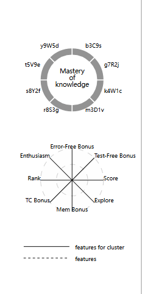

# D3_study
>本篇md用于解释作品中所出现图的d3渲染思路
> chart/graph/plot/diagram 没有明显的意义区分

## 0.General

笔者使用d3作图总结下来的基本思路：

1. **变量声明：**创建dom元素（html）；处理数据
2. **获取元素：**d3获取该元素，并提前声明好相关参数（如宽、高），使用js变量而非直接嵌入数值有利于代码维护和复用
3. **定义比例尺：**定义比例尺scale，将实际数据与实际渲染大小进行放缩，比例尺多种多样，比如线性、离散变量、区间变量，甚至颜色比例尺。
4. **定义生成器：**对于特殊的形状（除过矩形rect等），可能需要定义特殊的曲线、弧线生成器，实际上，他们也是基于属性配置的，无需担心
5. **渲染坐标轴**（根据需要）
6. **渲染图形：**特殊图形可能需要path元素调用生成器
7. **渲染图例：**使用text元素进行相关图例和标记
8. **样式调整：**对所有内容，例如布局位置，大小尺寸进行微调
9. **特殊渲染：**有些元素你希望渐变等特殊效果，可以使用css，甚至d3定义svg-defs

> \=\=\=\=\=\=\=\=\=\=\=\=\=\=\=\=\=\=\=\=\=\=\=\=\=\=\=\=\=\=\=\=\=\=\=\=\=\=\=\=\=\=\=\=\=\=\=\=\=\=\=\=\=\=
>
> 以上只是思路，细节代码可以从你的需求出发。
>
> 你可以以此为导向，在d3官方文档查到你想要的api，甚至可以直接询问LLM
>
> 特殊效果如css、svg可以查询MDN或询问LLM
> \=\=\=\=\=\=\=\=\=\=\=\=\=\=\=\=\=\=\=\=\=\=\=\=\=\=\=\=\=\=\=\=\=\=\=\=\=\=\=\=\=\=\=\=\=\=\=\=\=\=\=\=\=\=

## 1. Parallel/ScatterView

### 1.1 parallel graph

**平行线图**

> 注意，此图已经弃用，因为不适合作为此项目可视化，因此展示图使用较旧版

从一般的图表理解，分为x轴和y轴，x轴代表时间，y轴代表数值；

所以在平行线图中，可以这样理解：x轴代表的是不同属性，y轴代表的是数值

在本视图中，共有8个属性---------因此需要渲染8个“y轴”，“x轴”需要定义（为了确定每个Y轴的放置位置）但是无需渲染

### 1.2 scatter graph - PCA

散点图

每个属性具有8个指标，所以想要在二维平面可视化，就要对数据进行降维，常见的方法有==PCA、t-SNE，PCA==处理在后端使用sklearn处理，变为两个指标即可，这里数据结构为：

~~~json
{
    "student_id": xxx,
    "cluster": x,
    "transform": {
        "x": xxx,
        "y": xxx
    }
}
~~~

接下来就是常规的渲染步骤

## 2. PortraitView

### 2.1 relative axis and labels

这里的虚线坐标轴本质是圆圈、直线

### 2.2 circular barplot

旭日图/环形柱状图

### 2.3 radar/spider plot

雷达图

### 2.4 radialGradient

径向渐变渲染

## 3. StudentView

### 3.1 view pannel

视图框

### 3.2 tree diragram

树状图

## 4. QuestionView

### ~~view pannel~~

与StudentView的view pannel思路别无二致，不再赘述

### 4.1 area chart

填充图-折线图

### 4.2 horizontal stacked bar

水平堆栈图

### 4.3 candy chart

棒棒糖图

## 5. WeekView

### ~~circular barplot~~

同PortraitView中的，此处关键在于确定每个barplot的圆心位置

### 5.1 week axis

周视图坐标轴---每个子图的定位