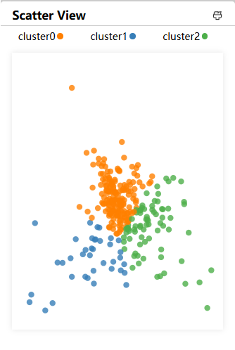
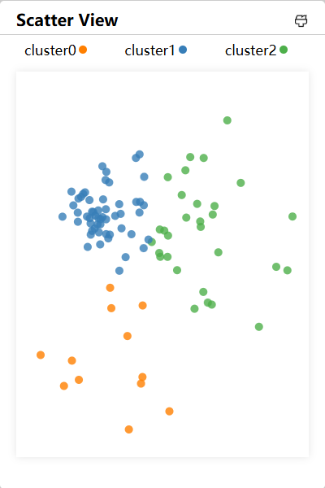
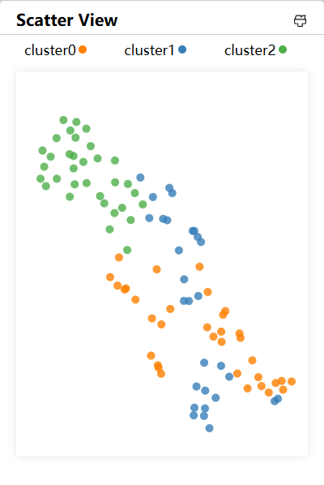
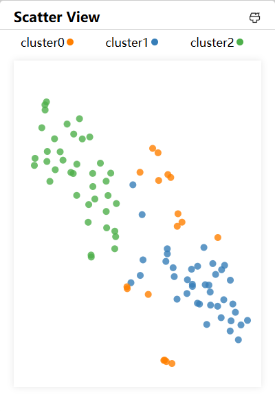
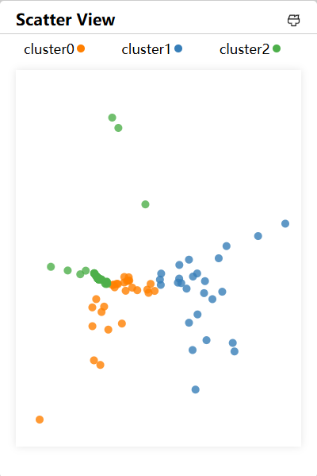
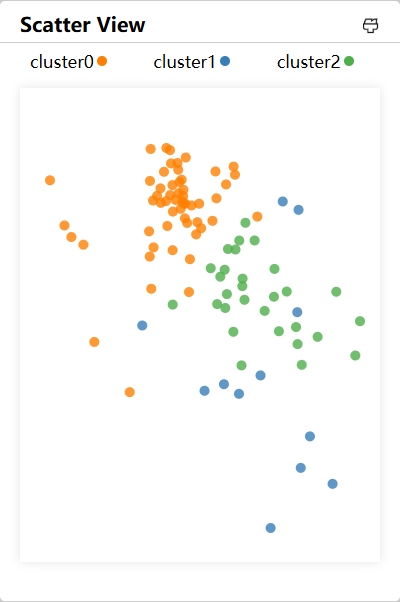
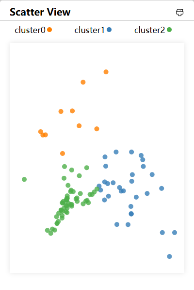

> 本文对比用到的两个机器学习方法：聚类、 降维
>
> 主要调用技术栈：scikit-learn
>
> 注意：
>
> 1. umap不在sklearn库中，需要单独安装umap-learn
>
> 2. 目前并没有在前端实现选择接口，需要后端修改参数
>
>    - 修改dimReduction: backend\tools\dim_reduction.py:line10
>
>    - 修改clustering: backend\tools\cluster_analysis: line51
>

# 聚类Clustering

提供的方法包括：K-Means、GMM

DBSCAN因为参数问题和无聚类中心问题暂不支持

使用的数据集为：Class1+2+3 & All major

# 降维DimReduction

提供的方法包括：PCA、UMAP、t-SNE、LocallyLinearEmbedding、MDS、Isomap

使用的数据集为：Class1 & All major

以下为PCA & UMAP

以下为t-SNE & lle

以下为MDS & Isomap

