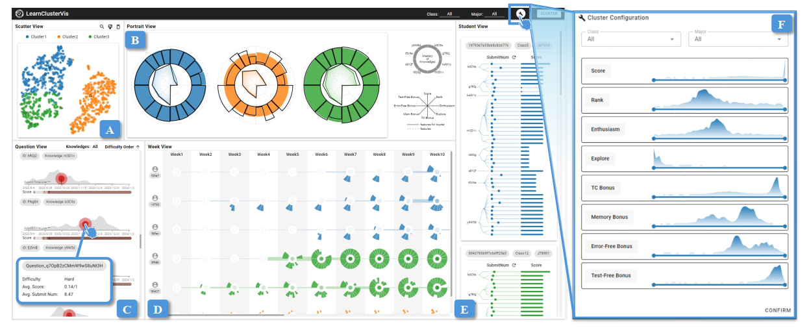

# 竞赛内容

NorthClass是一家知名的高等教育培训机构，开设了超过100门课程，涵盖文学、理学、工学、医学、经济学、管理学等多个学科领域，吸引了约30万名注册的学习者。该机构通过提供优质的教学服务，为学习者创造了一个灵活便捷的学习环境。为了顺应数字化时代的发展趋势，提升在科技领域中的市场竞争力，该机构策划并推出了一门编程课程，要求学习者在学习期间完成指定的编程任务，同时允许进行多次尝试和提交，以确保充分掌握和应用所学知识。 课程结束后，机构收集了学习者的时序学习数据，用于评估教学效果是否达到预设的标准和要求。为了优化教学资源和提升教学质量，该机构计划成立专门的智学发展革新小组，探索如何利用新一代人工智能技术赋能教育，以更好地培养适应新时代发展需求的创新型人才。可视化与可视分析利用高带宽的视觉感知通道，将复杂的时序学习行为数据转换为图形表达，对学习者的知识掌握水平进行诊断与分析，动态追踪学习行为的演变趋势，识别并剖析产生学习困难的潜在因素。 假如你是智学发展革新小组的成员，请您设计并实现一套可视分析解决方案，帮助该机构直观感知学习者的学习现状，为调整教学策略和课程设计提出可行的建议。  **请完成以下内容：**

1. 分析学习者答题行为日志记录，从答题分数、答题状态等多维度属性量化评估知识点掌握程度，并识别其知识体系中存在的薄弱环节。（建议参赛者回答此题文字不多于800字，图片不多于5张）

2. 结合学习者的特征挖掘个性化学习行为模式，从多角度设计并展示学习者画像，如答题高峰时段、偏好题型、正确答题率等。（建议参赛者回答此题文字不多于800字，图片不多于5张）

3. 不同的学习模式直接影响到学习者对知识的吸收、整合及应用能力，高效的学习模式能够促进知识的深度理解和长期记忆。请对学习模式与知识掌握程度之间的潜在关系进行建模，利用图表的形式呈现结果并简要分析。（建议参赛者回答此题文字不多于800字，图片不多于5张）

4. 合理的题目难度应当与学习者的知识掌握程度相匹配，当学习者知识掌握水平很高但答题正确率较低时，意味着题目难度超出了其能力范围。请试着利用可视分析方法找出这些不合理的题目。（建议参赛者回答此题文字不多于800字，图片不多于5张）

5. 结合上述分析结果，请你为题目设计者和课程管理人员提供一些宝贵的建议，以优化题库内容设置和改善教学质量，并简要说明理由。（建议参赛者回答此题文字不多于500字，图片不多于3张）

提供数据：详细信息请见赛道,下载数据后放在/data文件夹。

ChinaVis 2024数据可视化竞赛网页：<https://www.chinavis.org/2024/challenge.html>

以下为原获奖作品系统概览图

